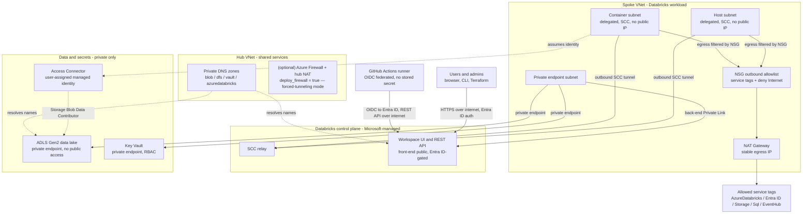

# Azure Databricks Platform — Architecture Context

> Purpose: this is the canonical architecture-decision reference for the secure,
> enterprise Azure Databricks platform built with Terraform and GitHub Actions.
> It is written for both human engineers and AI coding agents. Agents should treat
> the decisions and conventions here as **constraints**, not suggestions.
>
> Scope of this document: project structure, networking (landing zone), secure
> Databricks architecture, and identity/access. CI/CD and operational topics are
> tracked separately.

---

## 0. How to use this document

- Every section states a **decision** and the **rationale** behind it. When generating
  Terraform, follow the decision; if a request conflicts with it, surface the conflict.
- "Naming conventions are an API contract" — code that looks resources up by name relies
  on these conventions being stable. Do not invent ad-hoc names.
- Anything marked **MUST** is a hard rule. **SHOULD** is a strong default that can be
  overridden only with an explicit, stated reason.

### Deferred for this learning project — REVISIT before a client engagement

This repo is a learning build; the following are intentionally **out of scope for now** but
are **required for a production/client deployment** and must not be forgotten:

- **Observability / audit plane.** Diagnostic settings → Log Analytics for workspace,
  storage, Key Vault, firewall, and NSG flow logs; Databricks audit-log delivery / UC
  system tables; Microsoft Defender for Cloud + Defender for Storage. (No detection layer
  exists without this.)
- **Resilience.** Single availability zone for now — no AZ spread, no zone-redundant
  storage, no multi-region DR/BCDR. NAT Gateway is a zonal SPOF as drawn.
- **State backend hardening.** Bootstrap ownership, per-env RBAC on the state account,
  private endpoint + public-access-off + CMK + soft-delete/versioning on the Terraform
  state storage.

---

## 1. Project architecture and repository structure

**Decision.** Single repository (monorepo). Reusable Terraform written as modules under
`modules/`; each deployable environment is a separate root configuration under
`environments/` with its **own state file**. Shared, deploy-once infrastructure lives
under `shared-services/` with its own state file.

```
infrastructure/
├── modules/                    # reusable blueprints (no environment values)
│   ├── networking/
│   ├── databricks-workspace/
│   ├── storage/
│   ├── key-vault/
│   └── identity/
├── environments/               # one root module + one state file each
│   ├── dev/
│   ├── staging/
│   └── prod/
├── shared-services/            # hub network, DNS, UC metastore + group sync (own state)
└── .github/workflows/          # CI/CD pipelines
```

**Rationale.**
- A module is a *blueprint* (like a class); a root config is an *instantiation* with real
  values. Modules **MUST NOT** contain environment-specific values.
- One state file per deployment boundary isolates blast radius: a `plan`/`apply` in `dev`
  cannot see or touch `prod`. Things that change together and share an owner share a state
  file; things owned by different teams or with different lifecycles do not.
- Monorepo keeps modules and environment configs versioned together; per-directory review
  is enforced with `CODEOWNERS`.

**Cross-state dependencies — MUST.** When one config needs a resource owned by another
(e.g. Databricks needs the subnet IDs the networking config created), resolve it with an
**Azure data source** (e.g. `azurerm_subnet` looked up by name), **not** with
`terraform_remote_state` and **not** by hardcoding resource IDs.

- Why not hardcode: stale, invisible coupling that fails silently.
- Why not `terraform_remote_state`: forces read access to another team's full state file
  (which may hold secrets) and couples to their backend layout.
- Why Azure data source: Azure is the source of truth; works regardless of the other
  team's tooling; fails loudly if the dependency is missing. This is why **naming
  conventions are load-bearing** — they let any config find any resource by name.

**Deployment ordering.** `shared-services` (hub network, DNS, **UC metastore + account
group sync**) → spoke networking → security (Key Vault, identities) → workloads
(Databricks workspace + **metastore assignment / storage credential / external location**,
storage). Each step reads the previous step's outputs via Azure data sources.

---

## 2. Naming conventions and tagging

**Naming — MUST follow.** Pattern: `{resourceType}-{project}-{environment}-{region}-{instance}`.

- **`resourceType`** — the CAF abbreviation for the resource (table below). This is a hard
  standard, not a preference: name-based cross-state lookups depend on it.
- **`project`** — the short project/workload token, set once per root via the `project`
  variable (default `dbx`; 2–8 lowercase alphanumerics — Key Vault and storage-account
  length limits are the binding constraint). This is what makes the roots reusable across
  projects without name collisions. Hub resources add a function token before it
  (e.g. `vnet-hub-{project}-shared-...`).
- **`environment`** — `dev` | `staging` | `prod` | `shared`.
- **`region`** — the **abbreviated** region token, used **consistently in every name**
  (never the long form). Current platform region: **West US 3 → `wus3`**. (`eus2` =
  East US 2, etc. Keep a single map; the state-bootstrap script has one.)
- **`instance`** — zero-padded, e.g. `001`.

| Resource | Example (project = `dbx`) |
| --- | --- |
| Resource group (function-based) | `rg-networking-dbx-dev-wus3-001` |
| Virtual network | `vnet-dbx-dev-wus3-001` |
| Subnet | `snet-dbx-host-dev`, `snet-dbx-container-dev`, `snet-dbx-pe-dev` |
| Key Vault (24-char limit) | `kv-dbx-dev-wus3-001` |
| Storage account (no hyphens, ≤24) | `stdbxdevwus3001` |

**Rule — use the abbreviated region token everywhere.** Do **not** use the long region
name (`westus3`) in resource names; it makes names inconsistent and breaks the name-based
lookups. The long name is only a variable value (`location`), never part of a resource name.

**Resource type abbreviations (Microsoft CAF) — use these exact prefixes:**

| Resource | Prefix | Resource | Prefix |
| --- | --- | --- | --- |
| Resource group | `rg` | Private endpoint | `pep` |
| Virtual network | `vnet` | Public IP | `pip` |
| Subnet | `snet` | NAT gateway | `ng` |
| Network security group | `nsg` | Azure Firewall | `afw` |
| Route table | `rt` | Azure Firewall policy | `afwp` |
| VNet peering | `peer` | Databricks workspace | `dbw` |
| User-assigned identity | `id` | Databricks Access Connector | `dbac` |
| Key Vault | `kv` | Storage account | `st` |

Private DNS zones are **not** abbreviated — their name is the fixed `privatelink.*` domain.
Abbreviate the region/tokens further only where Azure imposes length limits (Key Vault ≤24;
storage accounts ≤24, alphanumeric, no hyphens). Source of truth for prefixes:
[CAF resource abbreviations](https://learn.microsoft.com/en-us/azure/cloud-adoption-framework/ready/azure-best-practices/resource-abbreviations).

**Databricks objects** (not Azure resources, so outside CAF) follow the same
`{type}-{project}-{env}-{region}-{instance}` shape with a Databricks-specific type token:
`mst` — Unity Catalog metastore (ADR-0011, e.g. `mst-dbx-shared-wus3-001`); `ncc` — serverless
Network Connectivity Config (ADR-0012, e.g. `ncc-dbx-dev-wus3-001`); `lb` — Lakebase database
instance (ADR-0013, e.g. `lb-dbx-dev-wus3-001`, lowercase and DNS-label-safe). The NCC name must
match Databricks' `^[0-9a-zA-Z-_]{3,30}$` and the region token is the workspace region.

**Tagging — MUST apply to every resource.** Minimum tags: `Environment`, `Owner`,
`CostCenter`, `ManagedBy` (always `terraform`), `Project`. Tags drive cost allocation,
incident ownership, and monitoring filters.

---

## 3. Landing zone and networking

**Decision.** Hub-spoke topology. A hub VNet holds shared network services — the four
Private DNS zones always, plus (optionally, [ADR-0007](decisions/0007-nat-gateway-nsg-egress-for-dev.md))
the Azure Firewall and its NAT Gateway. A Databricks **spoke** VNet holds the workload;
it **peers to the hub only in firewall (forced-tunneling) mode** — in NAT-egress mode the
spoke stands alone and consumes only the hub's DNS zones. Resource groups are organized
**by function** within an environment (`rg-networking-*`, `rg-databricks-*`,
`rg-storage-*`, `rg-security-*`, `rg-shared-*`).

**Rationale.** Hub-spoke gives one central place to enforce egress policy (when the
firewall is deployed), isolates spokes from each other, and shares services (DNS, on-prem
connectivity) once instead of per-workload. Function-based resource groups let RBAC
follow least privilege at the group boundary.

### Subnets for Databricks VNet injection — MUST

- **Two dedicated subnets**, both **delegated to `Microsoft.Databricks/workspaces`**:
  a **host** subnet and a **container** subnet. No other resources may share them.
- A **third subnet** for **private endpoints** (separate from the two delegated subnets).
- **Sizing (authoritative):** VNet CIDR `/16`–`/24`; each Databricks subnet at least
  `/26`. Azure reserves 5 IPs per subnet and Databricks uses 1 IP per node per subnet.
  **SHOULD** size each subnet `/24` or `/23` in production for headroom — subnet CIDRs
  **cannot be changed after the workspace is deployed** (expansion requires a Databricks
  account-team request or a new workspace), so under-sizing is expensive to fix.

### Traffic controls — MUST

- **NSGs** on the Databricks subnets. Databricks auto-creates and protects required NSG
  rules via the network intent policy; do not override them. (Adding *extra* rules is
  fine — the NAT egress mode below does — but only as standalone
  `azurerm_network_security_rule` resources, never inline blocks, or Terraform deletes
  the managed rules.)
- **Egress: exactly ONE of two modes** ([ADR-0007](decisions/0007-nat-gateway-nsg-egress-for-dev.md));
  either way, clusters need an **explicit** egress path — Azure retired default outbound
  access for new subnets (Sept 2025):
  - **Firewall mode (prod/client posture):** UDR routes `0.0.0.0/0` from the spoke
    subnets to the hub firewall's private IP so all egress is inspected; hub NAT Gateway
    behind the firewall for a stable egress IP. The firewall **MUST allowlist** the
    required Databricks/Azure control-plane endpoints (per region) or clusters silently
    fail to launch. FQDN-level control; ~$950/mo idle.
  - **NAT mode (current dev default):** a spoke-owned **NAT Gateway** on both delegated
    subnets (stable, auditable egress IP, ~$33/mo) + **NSG outbound service-tag
    allowlist** (`AzureDatabricks`, `AzureActiveDirectory`, `Storage.<region>`,
    `Sql.<region>`, `EventHub.<region>`) with a deny-Internet catch-all. Same L3/L4
    policy as the firewall rules, but **no FQDN filtering or inspection** — a service
    tag admits the whole regional service. Acceptable for dev; **not** for prod.

### Private connectivity and DNS — MUST

- **Private endpoints** for PaaS services (storage, Key Vault, Databricks control plane);
  **disable public network access** on those services.
- **Azure Private DNS zones** linked to the VNet so hostnames resolve to private IPs.
  Forgetting the DNS zone link is the classic failure: the endpoint exists, public access
  is off, but the cluster still resolves the old public IP and the connection fails.
  Zones in use:
  - `privatelink.blob.core.windows.net` and `privatelink.dfs.core.windows.net` (ADLS Gen2)
  - `privatelink.vaultcore.azure.net` (Key Vault)
  - `privatelink.azuredatabricks.net` (Databricks workspace)

**Governance.** Azure Policy enforces guardrails *before* workloads deploy: require tags,
deny storage accounts with public access, require NSGs on subnets, restrict allowed
regions. Policies are part of the landing zone, not an afterthought.

---

## 4. Secure Databricks architecture

**Two planes.** The **control plane** (UI, REST API, job scheduler, cluster manager,
SCC relay) runs in a **Microsoft-managed subscription**. The **compute plane** (clusters)
runs in **your** spoke VNet via VNet injection.

### Secure Cluster Connectivity (SCC / No Public IP) — MUST

Clusters have **no public IP and no open inbound ports**. The control plane cannot dial
in. Instead, on startup each cluster node **initiates an outbound connection up to the SCC
relay** and the control plane sends commands back down that established tunnel — a
**reverse tunnel**. This is the keystone: access is outbound-initiated, never inbound.

### Private Link — MUST (back-end)

- **Back-end Private Link** (`databricks_ui_api` sub-resource): private path from the
  **compute plane** (clusters) to the control plane / SCC relay. Lives on the private
  endpoint subnet in the workspace VNet. Region must match the workspace. Uses the
  `privatelink.azuredatabricks.net` zone.

### Front-end access — decision: internet + Entra ID (no front-end Private Link)

**Decision.** Users and tools (browser, CLI, Terraform, CI runners) reach the workspace
**over the public internet**, authenticated by **Entra ID**. We do **not** deploy
front-end Private Link, and there is therefore **no transit subnet / user VNet path**
requirement. Workspace **public network access stays enabled** for the front-end only.

**Rationale.** Users do not need to be on the corporate network; identity is the perimeter
for the front-end. This also keeps CI simple: GitHub-hosted runners can reach the workspace
REST API to manage cluster policies, Unity Catalog grants, and secret scopes (a private
front-end would have forced self-hosted runners inside the VNet).

**Hardening — MUST, because the front-end is internet-reachable:**

- **Entra ID Conditional Access** (MFA, device/compliance, and ideally trusted-location
  policies) on the Databricks enterprise app.
- The **compute plane remains fully private** (SCC, no public IP, back-end Private Link),
  and **data + secrets stay private** (storage / Key Vault private endpoints, public
  access off). Internet exposure is limited to the **authenticated front-end control
  surface only** — not to data or compute.

Workspace **IP access lists are deliberately NOT used** (ADR-0010): the front-end is
gated by identity alone. IP allowlists added operational friction (egress-IP churn,
Terraform lockout risk) without changing the trust model — identity is the perimeter.

Governing principle: **default-deny on the data/compute planes; gate the front-end with
identity rather than a private network path or IP allowlists.**

### Data-layer security — MUST

- **Storage (ADLS Gen2):** disable public network access; private endpoints for `blob`
  and `dfs` with their DNS zones; HTTPS-only, TLS 1.2 minimum; blob + container **soft
  delete** (blob **versioning is NOT supported** on hierarchical-namespace accounts —
  Azure rejects the combination; use **Delta Lake time travel** for point-in-time
  recovery instead); optionally customer-managed keys (CMK) in Key Vault.
- **Secretless compute–data auth:** deploy an **Azure Databricks Access Connector**
  carrying a **user-assigned managed identity**; grant that identity
  **`Storage Blob Data Contributor`** (data-plane only) on the storage. Databricks
  authenticates *as the identity* — **no account keys, SAS tokens, or service-principal
  secrets** stored anywhere.
- **Unity Catalog** for governance. UC splits across two deployment boundaries — get the
  placement right or environments will fight over shared, account-level objects:
  - **Account-level (deploy-once, in `shared-services`):** the **metastore is an
    account-level object, one per region, shared by every workspace** in that region. It is
    created with the **account-level `databricks` provider** (authenticated with the
    Databricks **account ID**, a different auth path than the per-workspace provider), not
    inside an environment root. The metastore carries **no root storage** — managed-table
    storage is declared **per catalog, owned by each environment** (ADR-0011), so no env's
    data ever lands in shared-services-owned storage. Identity sync is **AIM** (account
    console setting, no sync infra); the env-scoped access groups live in each env root
    via `modules/workspace-access` (ADR-0008).
  - **Workspace-level (per environment):** **metastore assignment** attaches the shared
    metastore to each env's workspace (resolved **by name** — the cross-state contract
    extended to Databricks account objects); then per-env a **storage credential** wraps
    the Access Connector identity, an **external location** binds an ADLS path to that
    credential (including the catalog's managed-storage container), and access is granted
    with SQL `GRANT` to the AIM-synced **Entra ID groups** (never individuals). All access
    is audit-logged. Namespace is `catalog.schema.table`.
- **Key Vault** for unavoidable secrets: RBAC authorization, private endpoint, purge
  protection, public access off. Notebooks read secrets via a **Key Vault-backed secret
  scope** (`dbutils.secrets.get`); the secret physically stays in Key Vault. Secrets
  **MUST NOT** appear in notebook code or as account keys when an identity can do the job.

### Workspace governance — MUST

- **Cluster policies** (JSON) constrain what cluster configs users can create. They are a
  **security** control, not just cost: they force every cluster to inherit VNet injection
  and SCC, so a user cannot create a cluster that bypasses the secured network. Typically
  lock: node types + autoscaling bounds, auto-termination, runtime version, and the
  data-access identity. Ship distinct policies (personal / jobs / shared).
- **Workspace hardening** (least functionality): restrict library install sources
  (supply-chain), control notebook result export/download (exfiltration), govern Git
  integration, disable features that would reopen a closed network path.

**Defense in depth.** Each layer assumes the one outside it may fail: network perimeter →
Private Link → storage hardening → managed identity (no portable secret) → Unity Catalog
grants → cluster policies + workspace hardening.

---

## 5. Identity and access management

**Managed identity = a service principal whose credential Azure owns and rotates** (no
secret you ever hold). "Access is something you *are*, not something you *hold*."

**Decision — MUST default to user-assigned managed identities.**

- **System-assigned**: 1:1, born/dies with its resource. On Terraform recreate, the
  identity gets a **new object ID**, so the role assignment must be recreated and then
  **re-propagates** through Azure RBAC — a window where the workload gets `403` even though
  state looks correct.
- **User-assigned**: standalone resource, 1:many, independent lifecycle. Survives
  `destroy`/`apply` of workloads; can be shared across resources; can be granted **ahead
  of time** so security reviews it once. Stable identities are auditable identities.

**Secretless CI/CD — MUST.** GitHub Actions authenticates to Azure with a **service
principal that has a federated credential** trusting **GitHub's OIDC** tokens, scoped to a
specific **repo + branch/environment**. The runner presents a short-lived OIDC token; Azure
validates it against the federated credential and issues a real token valid for minutes.
**No client secret is stored in GitHub.** The repo/branch scoping means another repo's
token fails the condition and is rejected.

**RBAC — MUST.** Every assignment is `principal × role × scope`.

- **Scope** nests: management group → subscription → resource group → resource, and
  inherits **downward**. Assign at the **narrowest scope** that satisfies the need.
- **Role**: prefer the **most specific built-in role** (e.g. `Storage Blob Data
  Contributor`, not `Contributor`/`Owner`). Custom roles only when no built-in fits;
  they are a maintenance burden as Azure adds actions.
- **Principal**: assign to **Entra ID groups mapped to job functions**, almost never to
  individuals.
- **Automation principals MUST NOT hold `Owner`** (it carries User Access Administrator =
  privilege escalation). Scope the CI/CD principal **per-subscription-per-environment**, not
  at a management group spanning environments.
- All assignments live in Terraform — reviewable in code, auditable in git history.

---

## 6. Network architecture diagram

Current dev topology — **NAT egress mode** ([ADR-0007](decisions/0007-nat-gateway-nsg-egress-for-dev.md)).
In firewall mode the spoke instead force-tunnels `0.0.0.0/0` to the hub Azure Firewall
(deployed with `deploy_firewall = true`) and peers to the hub VNet.



---

## 7. Hard rules summary (quick reference for agents)

1. Modules hold no environment values; one state file per deployment boundary.
2. Cross-state dependencies via Azure **data sources** by name — never `remote_state`,
   never hardcoded IDs.
3. Follow the naming convention exactly; apply the required tag set to every resource.
4. Two delegated Databricks subnets (`/26`+, `/23`–`/24` in prod) + a private-endpoint
   subnet; VNet `/16`–`/24`.
5. Exactly one egress mode per spoke (ADR-0007): forced tunneling to the hub firewall
   with an egress allowlist (prod posture), or spoke NAT Gateway + NSG service-tag
   allowlist with deny-Internet (dev default). Private endpoints + linked Private DNS
   zones for every PaaS service in both modes.
6. SCC on (no public IP); **back-end** Private Link for the compute plane. Front-end is
   internet-reachable, gated by Entra ID (no front-end Private Link, no workspace IP
   access lists — ADR-0010). Data/secret planes stay private (public access off).
7. Secretless data access via Access Connector **user-assigned managed identity** +
   `Storage Blob Data Contributor`; governance via Unity Catalog; secrets only in Key
   Vault-backed scopes.
8. Cluster policies force VNet injection + SCC on every cluster; workspace hardened to
   least functionality.
9. User-assigned managed identities by default; CI/CD via OIDC federated credential scoped
   to repo+branch; no stored secrets.
10. RBAC: narrowest scope, most specific built-in role, groups not individuals, never
    `Owner` for automation.

---

_Last reviewed against Azure/Databricks docs: June 2026. Re-verify endpoint lists, subnet
limits, and Private Link sub-resource names against current Microsoft Learn before relying
on them in production._
